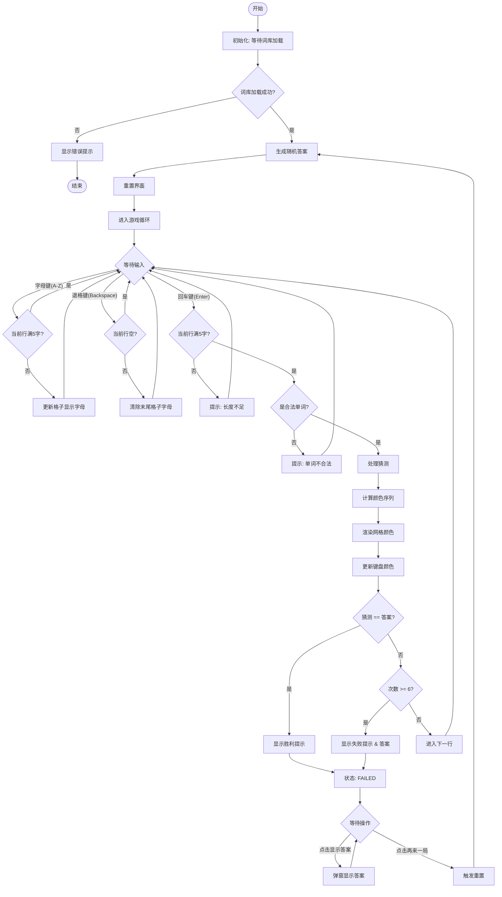

# Wordle 游戏复刻版

这是一个使用原生 HTML、CSS 和 JavaScript 构建的经典 Wordle 猜词游戏复刻版。

## 🎮 游戏简介

Wordle 是一款风靡全球的每日猜词游戏。玩家有 6 次机会猜出一个 5 个字母的英文单词。
每次猜测提交后，游戏的网格会通过颜色反馈来提示字母的匹配情况。

### 规则说明

- **🟩 绿色**：字母正确且位置正确。
- **🟨 黄色**：字母在单词中存在，但位置不对。
- **⬜ 灰色**：字母不在单词中。

## ✨ 主要功能

- **完整游戏循环**：生成随机答案、处理输入、判断胜负。
- **双重输入支持**：支持电脑物理键盘按键和屏幕上的虚拟键盘点击。
- **智能词库**：通过 `words.json` 异步加载单词列表，并验证输入是否为合法单词。
- **游戏辅助**：
  - **再来一局**：通过点击按钮快速重置游戏状态，无需刷新页面。
  - **显示答案**：实在猜不出时，可点击按钮查看当前答案（调试用）。
- **优秀的视觉体验**：深色模式主题，响应式布局，清晰的颜色反馈。

## 🛠️ 技术栈

本项目采用纯原生前端技术栈开发，无任何第三方框架依赖：

- **HTML5**：构建语义化的页面结构。
- **CSS3**：使用 Flexbox 和 Grid 布局，实现自适应界面和键盘样式。
- **JavaScript (ES6+)**：
  - `async/await` 处理异步词库加载。
  - 事件委托 (Event Delegation) 优化性能。
  - 闭包 (Closure) 管理游戏状态。

## � 程序流程图

下图展示了游戏的核心交互逻辑与生命周期：



## �🚀 快速开始

1. **克隆或下载项目**到本地。
2. **启动本地服务器**：
   由于项目使用了 `fetch` API 加载 `words.json`，出于浏览器安全策略（CORS），直接双击打开 `index.html` 可能无法正常加载词库。
   
   推荐使用以下方式之一运行：
   - **VS Code**: 安装 "Live Server" 插件，右键 `index.html` 选择 "Open with Live Server"。
   - **Python**: 在项目根目录下打开终端，运行 `python -m http.server`。
   - **Node.js**: 使用 `http-server` 或其他静态服务工具。

3. **开始游戏**：在浏览器中访问对应的本地地址（如 `http://127.0.0.1:5500/project/index.html`）。

## 📂 项目结构

```
project/
├── index.html      # 游戏主页面
├── index.css       # 样式文件 (暗色主题、网格布局)
├── index.js        # 核心逻辑 (输入处理、状态管理、算法)
├── words.json      # 单词数据库
├── ai_guide.md     # 开发过程与 AI 对话日志
└── readme.md       # 项目说明文档 (本文)
```

## 🤝 贡献与致谢

- 感谢 Wordle 原作者 Josh Wardle 带来的灵感。
- 本项目包含详细的 AI 辅助开发记录，详见 `ai_guide.md`。